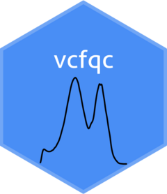

<!-- README.md is generated from README.Rmd. Please edit that file -->

```{r, include = FALSE}
knitr::opts_chunk$set(
  collapse = TRUE,
  comment = "#>",
  fig.path = "man/figures/README-",
  out.width = "100%"
)
```

# vcfqc 

<!-- badges: start -->
<!-- badges: end -->


vcfqc is a tool that can visualize the distribution of quality annotation values in a table summary of VCF files. This visualization can help in setting threshhold values for hard-filtering.

## Installation

You can install the latest version of vcfqc by copying the following commands into R console:

``` r
library(devtools)
devtools::install_github("avramaral/GPcov", build_vignettes = TRUE)
```

## Example

This is an example of quality by depth (QD) annotation distribution

```{r example}
library(vcfqc)
QD(system.file("extdata", "HG001_GRCh38.table", package = "vcfqc"))
```
