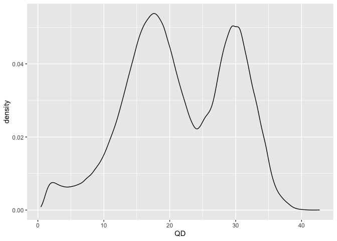

<!-- README.md is generated from README.Rmd. Please edit that file -->

# vcfqc 

<!-- badges: start -->
<!-- badges: end -->

vcfqc is a tool that can visualize the distribution of quality
annotation values in a table summary of VCF files. This visualization
can help in setting threshhold values for hard-filtering.

## Installation

You can install the latest version of vcfqc by copying the following
commands into R console:

``` r
library(devtools)
devtools::install_github("avramaral/GPcov", build_vignettes = TRUE)
```

## Example

This is an example of quality by depth (QD) annotation distribution

``` r
library(vcfqc)
QD(system.file("extdata", "HG001_GRCh38.table", package = "vcfqc"))
#> All variants are annotated with QD score
#> 
#>    Min. 1st Qu.  Median    Mean 3rd Qu.    Max. 
#>    0.43   15.41   20.42   21.21   28.66   42.71 
#> 
#> Number of variants with a QD score lower than 2: 41225
#> 
#> Expected plot: 
#> __________________________________________________________
#> There are two peaks where the majority of variants are (around QD = 12 and QD = 32). 
#> These two peaks correspond to variants that are mostly observed in heterozygous (het) versus mostly homozygous-variant (hom-var) states, respectively, in the called samples. 
#> This is because hom-var samples contribute twice as many reads supporting the variant than do het variants. 
#> We also see, to the left of the distribution, a 'shoulder' of variants with QD hovering between 0 and 5.
```


